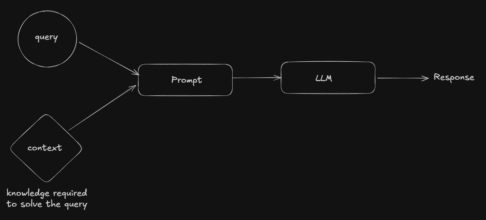
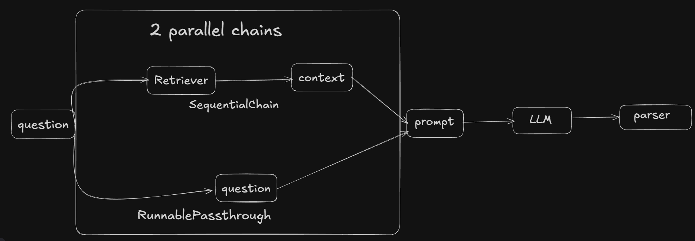

# LLMs

**Large Language Models (LLMs)** are massive, transformer-based neural network architectures that are pre-trained on enormous amounts of text data, often drawn from large portions of the internet. They store their core learned knowledge in the form of  **parameters** , specifically the internal **weights and biases** of the neural network. Because this knowledge is embedded within the model’s parameters, it is referred to as  **parametric knowledge**.

LLMs store knowledge in billions of numerical **[parameters](https://www.google.com/search?q=parameters&rlz=1C1CHBF_enIN1166IN1166&oq=how+llms+store+theri+knowleadge+in+wirghtws+and+parameters%3F&gs_lcrp=EgZjaHJvbWUyBggAEEUYOTIJCAEQIRgKGKABMgkIAhAhGAoYoAEyCQgDECEYChigATIJCAQQIRgKGKAB0gEJMTEyMDNqMGo3qAIAsAIA&sourceid=chrome&ie=UTF-8&mstk=AUtExfAwU-h_5txsW0rOr_rE8GibLNb9zJgW4Vny3YAklv-w5Apelpz1tdGNLghExbCqPVTxZM7Y7GauAo4I_Sl0eLAYc-0dTNC2tpGpF3XSU66NpE0BoGGjppNJcF_MYMJjcG1KCkfq1wpSJf2oR5GnkexaTuYHWVlbPWnrwT-CrPMcAgg&csui=3&ved=2ahUKEwiv2b6g_fORAxXXT2wGHankJBYQgK4QegQIARAB) (weights and biases)**  within their deep neural networks , which are adjusted during training to capture statistical patterns, grammar, factual associations, and relationships from vast text data.The knowledge stored in an LLM is **not textual knowledge** in the form of sentences or documents. Instead, it consists of **statistical representations and learned functions** acquired through pattern recognition during training. These learned functions encode relationships between words, phrases, and contexts, enabling the model to estimate probabilities and **predict the next word** in a sequence based on the input it receives.

At their core, LLMs function as  **next-word (or next-token) predictors** . Given a sequence of words, the model predicts which word is most likely to come next. This prediction is not based on memorization, but on **pattern recognition** learned during training across vast and diverse text data.

During training, an LLM captures the *learned statistical essence* of language—such as grammar, semantics, style, and factual correlations—and encodes it into its parameters. This allows the model to generate *new* and plausible responses by recombining learned patterns, rather than simply recalling or copying sentences it has seen before.

A **model** can be thought of as a large mathematical function. For example, consider the function:  `f(x) = a·x + b`. Here, **x** is the input to the model (similar to a prompt), and **a** and **b** are the model’s  **parameters**. **Training a model** means finding the most suitable values for these parameters so that the model exhibits the desired behavior. The goal is to adjust the parameters in a way that the model’s output closely matches real-world expectations or known data.

For instance, if **x** represents a person’s height in centimeters and the goal is to predict their weight, we can tune the parameters accordingly. Suppose we determine that the best values are **a = 0.5** and  **b = −20** . With these parameters, if a person’s height is **200 cm** (2 meters), the model outputs  `f(200) = 0.5 × 200 − 20 = 80`, which corresponds to a predicted weight of  **80 kg** .

Parameters are internal numerical values that store an LLM’s understanding of language. They work like adjustable knobs inside a [neural network](https://tensorwave.com/glossary/neural-network), each one tuned to recognize patterns in text. A 7-billion-parameter model contains 7 billion of these values. There are two broad categories:

* **Trainable Parameters:** **These are the internal weights and biases that constitute the model's fundamental knowledge and are learned during training.**
* **Hyperparameters:** **These are external settings configured by human developers that control how the model learns and generates output during inference, such as the learning rate, temperature (creativity dial), or the maximum number of output tokens.**

# Nueral Networks

Neural networks are machine learning models that mimic the complex functions of the human brain. These models consist of interconnected nodes or neurons that process data, learn patterns and enable tasks such as pattern recognition and decision-making.

Core Function

1. **Input:** **Data enters the input layer.**
2. **Processing:** **Each neuron in a hidden layer receives inputs, multiplies them by weights, adds bias, and passes the result through an activation function.**
3. **Output:** **The final layer produces the network's prediction or classification.**
4. **Learning (Training):** **The network compares its output to the correct answer, calculates an error, and uses algorithms (like backpropagation) to adjust weights and biases to reduce future errors.**

Key Components & How They Work

* **Nodes/Neurons:** **Basic processing units that receive input, perform calculations, and send output.**
* **Layers:** **Neurons are organized into input, hidden (processing), and output layers.**
* **Connections & Weights:** **Each connection has a weight, determining the signal's strength; these weights are adjusted during learning.**
* **[Bias](https://www.google.com/search?q=Bias&rlz=1C1CHBF_enIN1166IN1166&oq=nueral+netoworks&gs_lcrp=EgZjaHJvbWUqBggAEEUYOzIGCAAQRRg7MgwIARAAGA0YsQMYgAQyCQgCEAAYDRiABDIJCAMQABgNGIAEMgkIBBAAGA0YgAQyBggFEEUYPDIGCAYQRRg8MgYIBxBFGDzSAQgzODk4ajBqN6gCCLACAfEF-GCoFQ0Fgo_xBfhgqBUNBYKP&sourceid=chrome&ie=UTF-8&ved=2ahUKEwj2ruDr-fORAxUia2wGHb9RFWsQgK4QegYIAQgEEAQ):** **An additional parameter in neurons that shifts the activation function, adding flexibility.**
* **[Activation Function](https://www.google.com/search?q=Activation+Function&rlz=1C1CHBF_enIN1166IN1166&oq=nueral+netoworks&gs_lcrp=EgZjaHJvbWUqBggAEEUYOzIGCAAQRRg7MgwIARAAGA0YsQMYgAQyCQgCEAAYDRiABDIJCAMQABgNGIAEMgkIBBAAGA0YgAQyBggFEEUYPDIGCAYQRRg8MgYIBxBFGDzSAQgzODk4ajBqN6gCCLACAfEF-GCoFQ0Fgo_xBfhgqBUNBYKP&sourceid=chrome&ie=UTF-8&ved=2ahUKEwj2ruDr-fORAxUia2wGHb9RFWsQgK4QegYIAQgEEAY):** **A mathematical function (like ReLU or Sigmoid) that introduces non-linearity, allowing networks to learn complex patterns.**

# RAG(Retrieval Augumented Generation)

Sometimes we don't get desired results from the LLM, this happens in below scenarios:

1. Private Data Source: What is my best sell product?
2. New recent Data like what is the biggest news on india today. ChatGPT can because it has access to tools to search the internet
3. Hallucinations: Generative AI models produce incorrect, nonsensical, or fabricated information presented confidently as fact, stemming from pattern-matching errors, biased/incomplete training data, or model limitations, leading to issues like fake legal citations, wrong historical facts, or inaccurate medical advice, requiring users to verify outputs, especially in critical fields.

We can solve above problems using fine-tuning to some extent. fine-tuning is when we train a pre-trained model with some domain-specific training data to make it more reliable in that domain. Supervised, unsupervised, Reinforcement Learning and Human Feedback fine tuning using tens of thousands of labelled data(i.e. examples)

Fine-tuning is expensive.We need to retrain the model  and if the domain is constantly evolving we need to do more and more finc-tuning over the time. One more problem is you need talent for fine-tuning your model, you need AI engineers and data scientists that also increase the cost.

Then came In-Context learnning. For a given task to be completed by LLM, we will send some examples of the tasks (labelled data) along with the new unlabelled task whose result we want to find in the prompt. The LLM will try to learn from the given examples and use that knowledge to solve the new task at hand. This in-context learning is an emergent property of the LLM. Giving example of task in the prompt and then asking for a new task is also called few-shot prompting. Till now we are using few-shot prompting for In-context learning of the LLM.

We can improve in-context leaning by sending the entire context required to solve the task along with the query, inside the prompt rather than few shot prompting. This context enchances the parametric knowledge of the LLM. This is RAG.

For example, a user has some doubt in a youtube video, we can send the transcript of the specific time window where the user has the doubt. Now along with the doubt we wil send this transcript to the LLM as context. This context is all that LLM needs to answer that doubt.

RAG is way to make a LLM smarter by giving it extra information at the time you ask the question. We send the knowledge required to solve the task alognside the query within the prompt. The model combines it's paramatric knowledge with the context given and tries the solve the query.

Prompt  in Augumetaion process, this promptTemplate solves the hallucination problem. For recent development problem, we can just extra information to our vector store.

```
You are a helpful assistant. Answer the question only from the given context. 
If the context is insufficient, just say you don’t know.
{context}
Question: {question}
```



RAG is information retrieval + Text generation. Stages of RAG:

- Indexing: Text ingestion(Load text in memory), Perform Chunking, Create embedding vectors, Store embedding vectors
- Retrieval: Create embedding vector for query, search for most similar/close vectors (semantic search), Create Ranking of resultant vectors, Send top_k vectors
- Augumentation: create the prompt using both the query and context and send that to LLM. increasing the size of paramatric knowledge by giving context.
- Generation: (In-context capabilities + LLMs paramatric knowledge  + text generation capabilities ) to generate the appropriate response.

---

# RAG

Sometimes, we do not get the desired results from an LLM. This typically happens in the following scenarios:

1. **Private Data Sources** : LLMs do not have access to private or proprietary data unless it is explicitly provided to them. For example, a question like *“What is my best-selling product?”* cannot be answered accurately because the model has no visibility into an organization’s internal sales data.
2. **New or Recent Data** : LLMs are trained on data up to a certain cutoff and may not know about very recent events. Questions such as *“What is the biggest news in India today?”* require up-to-date information. Some systems, like ChatGPT, can handle this by using external tools (e.g., web search) to fetch current data, but the base model alone cannot.
3. **Hallucinations** : Generative AI models can sometimes produce incorrect, nonsensical, or fabricated information while presenting it confidently as fact. This occurs due to pattern-matching errors, biased or incomplete training data, or inherent model limitations. Hallucinations may result in fake legal citations, incorrect historical facts, or inaccurate medical advice. Because of this, outputs from LLMs—especially in critical domains—should always be verified before being trusted.

We can address some of the above problems using  **fine-tuning** , but only to a certain extent. **Fine-tuning** involves taking a pre-trained model and further training it on **domain-specific data** so that it behaves more reliably and consistently within that domain. This additional training can be done using approaches such as  **supervised learning, unsupervised learning, reinforcement learning, and reinforcement learning with human feedback (RLHF)** , often requiring  **tens of thousands of labeled examples** .

However, fine-tuning comes with several limitations. First, it is  **expensive** , as it requires additional training runs on large models, which demand significant computational resources. Second, if the domain knowledge is  **constantly evolving** , the model must be fine-tuned repeatedly to stay up to date, further increasing cost and maintenance effort. Third, fine-tuning requires  **specialized expertise** —AI engineers and data scientists are needed to prepare high-quality datasets, manage training pipelines, and evaluate model performance, which adds to operational costs.

Additionally, fine-tuning does not inherently solve problems related to  **real-time or private data access** . Even a fine-tuned model cannot know new information unless it is retrained, and it still cannot access private or proprietary data unless that data is explicitly included during training. There is also a risk of  **overfitting** , where the model becomes too specialized and performs worse on general tasks.

Because of these trade-offs, fine-tuning is best suited for **stable, well-defined domains** where high accuracy is critical and the knowledge does not change frequently. In many real-world systems, it is often combined with other techniques—such as retrieval-based methods—to balance cost, flexibility, and accuracy.

Then came  **In-Context Learning (ICL)** . For a given task that an LLM needs to perform, we provide a few **example tasks along with their correct outputs (labeled data)** directly inside the prompt, followed by a **new, unlabeled task** whose output we want the model to generate. The LLM infers the pattern from the provided examples and applies it to solve the new task. This ability to learn from examples at inference time—without updating model parameters—is an  **emergent property of large language models** . Providing examples in the prompt and then asking the model to solve a similar task is known as  **few-shot prompting** , which is the most common way In-Context Learning is used today.

We can further improve In-Context Learning by supplying **explicit task-relevant context** instead of (or in addition to) example-based prompting. Rather than relying only on patterns learned during pretraining (parametric knowledge), we inject the **exact information needed to solve the task** directly into the prompt. This externally provided context temporarily augments the model’s knowledge for that specific query. This approach is known as  **Retrieval-Augmented Generation (RAG)** .

For example, if a user has a doubt about a specific moment in a YouTube video, we can retrieve and send the **transcript of the relevant time window** along with the user’s question. By providing this transcript as context, the LLM has all the necessary information to answer the doubt accurately, without needing prior knowledge of the video. In this way, RAG enhances the model’s responses by grounding them in  **relevant, up-to-date, and task-specific information** , rather than relying solely on its stored parametric knowledge.

**Retrieval-Augmented Generation (RAG)** is a way to make an LLM smarter by providing it with  **additional information at the time of querying** . Instead of relying only on its internal,  **parametric knowledge** , we send the  **knowledge required to solve the task alongside the user’s query within the prompt** . The model then combines its parametric knowledge with the provided context to generate an informed and grounded response.

In RAG, the  **prompt plays a key role in the augmentation process** . A well-designed prompt template helps reduce hallucinations by strictly constraining the model to use only the supplied context. For example:

```You
You are a helpful assistant. Answer the question only from the given context. 
If the context is insufficient, just say you don’t know.
{context}
Question: {question}
```

This prompt ensures that the model does not invent information outside the retrieved knowledge. For  **recent or evolving information** , we can simply add new data to the  **vector store** , allowing the system to stay up to date without retraining the model.

At a high level,  **RAG = Information Retrieval + Text Generation** . It consists of the following stages:

* **Indexing** : Text is ingested and loaded into memory, then **chunked** into smaller pieces. Embeddings are created for each chunk, and these embedding vectors are stored in a vector database.
* **Retrieval** : An embedding vector is generated for the user’s query, which is then used to perform **semantic search** against the stored vectors. The results are ranked by similarity, and the top-k most relevant chunks are selected.
* **Augmentation** : The retrieved context is combined with the user’s query to construct a prompt. This step effectively **augments the model’s parametric knowledge** by injecting task-specific information at inference time.
* **Generation** : The LLM uses its  **in-context learning ability** , combined with its parametric knowledge and text generation capabilities, to produce the final response grounded in the provided context.

```
import tiktoken

enc = tiktoken.get_encoding("cl100k_base")
text = "LangChain makes RAG easier"
tokens = enc.encode(text)

print(tokens)
print(len(tokens))  # token count
decoded = enc.decode(tokens)
print(decoded)

[27317, 19368, 3727, 432, 1929, 8831]
6
LangChain makes RAG easier
```

# Tiktoken

**tiktoken** is **OpenAI’s fast tokenizer** used to convert text ↔ tokens for LLMs (GPT-3.5 / GPT-4 / GPT-4o style models).

You mainly use it to:

* **Count tokens** (before sending prompts → cost & limit control)
* **Chunk text** correctly for RAG / embeddings
* **Estimate prompt size** to avoid context overflow

---

## What is a token?

A token is  **not a word** .

It can be:

* part of a word (`"intelli"` + `"gence"`)
* a whole word
* punctuation / whitespace

```
"ChatGPT is powerful"
→ ["Chat", "G", "PT", " is", " powerful"]  (≈5 tokens)
```

### Why tiktoken matters

- Given you work with LangChain, RAG, vector stores, embeddings:
- Chunking by characters is wrong
- Chunking by tokens is correct
- Embedding models have strict token limits
- tiktoken is the ground truth tokenizer used by OpenAI models.

# Why we cannot perform chunking by character?

- ### LLMs do NOT see characters

LLMs **never** read characters or words. They read  **tokens**.So when you chunk by characters, you are chunking in a unit  **the model does not understand** .

```
Model input pipeline:
Characters → Tokens → Embeddings → Vector

```

If your chunk boundary cuts  **inside a token** , the model sees something  *unnatural* .

```
"authentication"
Character chunk: "authenti" | "cation"

Tokens:
"authen" + "tication"   ❌ broken semantic unit

```

This  **hurts embedding quality** .

- ### Token limits are HARD limits in LLMs that we cannot exceed. Token-based chunking  **guarantees safety** .
- ### We want each vector to have exact number of tokens

  Equal token size of each vector, does not mean each vector will contain equal semanctic meaning but it gurantees equal compute.

### Embedding model behavior

* Each embedding vector represents **token distribution**
* Very small chunks → weak semantics/meaning
* Very large chunks → diluted meaning

Token-based chunking gives:

* Consistent semantic density
* Comparable embedding vectors
* Stable similarity scores

This is  **critical for FAISS / Chroma retrieval quality** .

## Retrieval quality breaks with character chunking

Character chunking causes:

* Variable token sizes
* Unequal semantic density
* Inconsistent cosine similarity

Example:

<pre class="overflow-visible! px-0!" data-start="1814" data-end="1892"><div class="contain-inline-size rounded-2xl corner-superellipse/1.1 relative bg-token-sidebar-surface-primary"><div class="sticky top-[calc(--spacing(9)+var(--header-height))] @w-xl/main:top-9"><div class="absolute end-0 bottom-0 flex h-9 items-center pe-2"><div class="bg-token-bg-elevated-secondary text-token-text-secondary flex items-center gap-4 rounded-sm px-2 font-sans text-xs"></div></div></div><div class="overflow-y-auto p-4" dir="ltr"><code class="whitespace-pre!"><span><span>Chunk </span><span>A</span><span> → </span><span>80</span><span> tokens (weak signal)
Chunk </span><span>B</span><span> → </span><span>600</span><span> tokens (</span><span>strong</span><span> signal)
</span></span></code></div></div></pre>

During retrieval:

* Chunk B dominates
* Chunk A never retrieved

  ❌ biased RAG results

Token chunking fixes this.

## Overlap only works correctly with tokens

Overlap is meant to:

* preserve sentence continuity
* avoid cutting concepts

Character overlap:

<pre class="overflow-visible! px-0!" data-start="2158" data-end="2200"><div class="contain-inline-size rounded-2xl corner-superellipse/1.1 relative bg-token-sidebar-surface-primary"><div class="sticky top-[calc(--spacing(9)+var(--header-height))] @w-xl/main:top-9"><div class="absolute end-0 bottom-0 flex h-9 items-center pe-2"><div class="bg-token-bg-elevated-secondary text-token-text-secondary flex items-center gap-4 rounded-sm px-2 font-sans text-xs"></div></div></div><div class="overflow-y-auto p-4" dir="ltr"><code class="whitespace-pre!"><span><span>overlap</span><span>=</span><span>200</span><span> chars  ❌ unpredictable
</span></span></code></div></div></pre>

Token overlap:

<pre class="overflow-visible! px-0!" data-start="2217" data-end="2252"><div class="contain-inline-size rounded-2xl corner-superellipse/1.1 relative bg-token-sidebar-surface-primary"><div class="sticky top-[calc(--spacing(9)+var(--header-height))] @w-xl/main:top-9"><div class="absolute end-0 bottom-0 flex h-9 items-center pe-2"><div class="bg-token-bg-elevated-secondary text-token-text-secondary flex items-center gap-4 rounded-sm px-2 font-sans text-xs"></div></div></div><div class="overflow-y-auto p-4" dir="ltr"><code class="whitespace-pre!"><span><span>overlap</span><span>=</span><span>50</span><span> tokens  ✅ stable
</span></span></code></div></div></pre>

This is why LangChain internally uses  **token-based splitters** .

## 6️⃣ Why “exact number of tokens” is not the *main* goal

Important nuance ⚠️

You do **NOT** need *exactly* 500 tokens.

What you need is:

* **≤ max token limit**
* **consistent token scale**
* **no token breakage**

So this is fine:

<pre class="overflow-visible! px-0!" data-start="2561" data-end="2586"><div class="contain-inline-size rounded-2xl corner-superellipse/1.1 relative bg-token-sidebar-surface-primary"><div class="sticky top-[calc(--spacing(9)+var(--header-height))] @w-xl/main:top-9"><div class="absolute end-0 bottom-0 flex h-9 items-center pe-2"><div class="bg-token-bg-elevated-secondary text-token-text-secondary flex items-center gap-4 rounded-sm px-2 font-sans text-xs"></div></div></div><div class="overflow-y-auto p-4" dir="ltr"><code class="whitespace-pre!"><span><span>480–520 tokens ✔️
</span></span></code></div></div></pre>

But this is bad:

<pre class="overflow-visible! px-0!" data-start="2605" data-end="2639"><div class="contain-inline-size rounded-2xl corner-superellipse/1.1 relative bg-token-sidebar-surface-primary"><div class="sticky top-[calc(--spacing(9)+var(--header-height))] @w-xl/main:top-9"><div class="absolute end-0 bottom-0 flex h-9 items-center pe-2"><div class="bg-token-bg-elevated-secondary text-token-text-secondary flex items-center gap-4 rounded-sm px-2 font-sans text-xs"></div></div></div><div class="overflow-y-auto p-4" dir="ltr"><code class="whitespace-pre!"><span><span>120 tokens vs 900 tokens ❌</span></span></code></div></div></pre>


